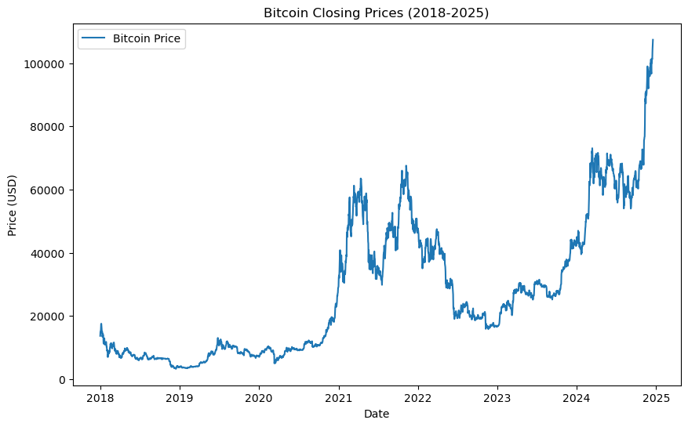
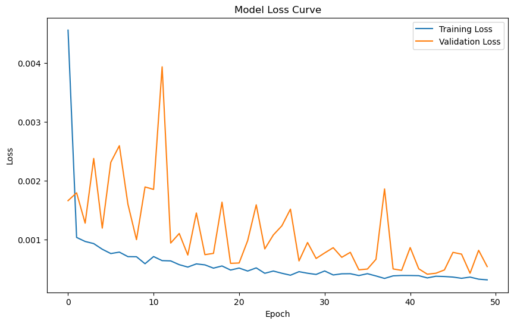
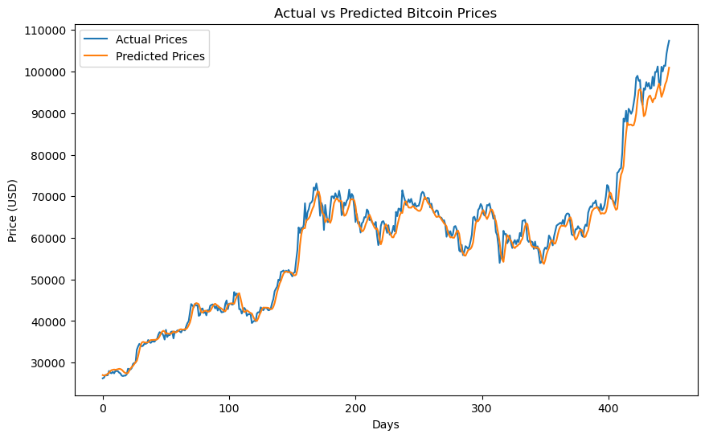
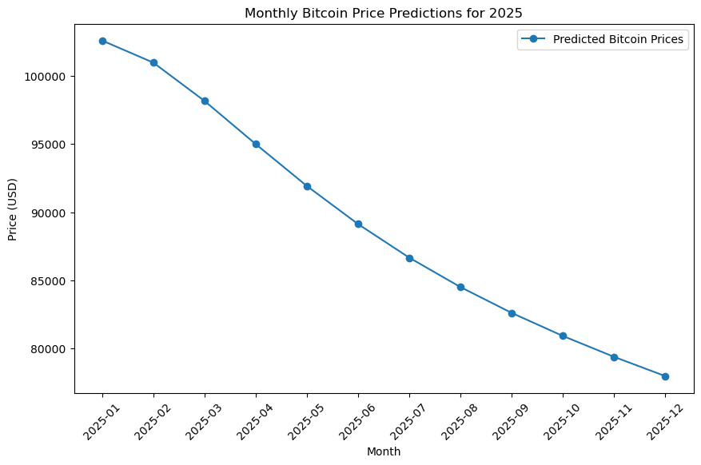

# BTC Price Prediction

A deep learning project that predicts Bitcoin prices for 2025 using LSTM neural networks and historical price data.

---

## 📊 Results

### Bitcoin Historical Prices (2018-2025)

### Model Training Loss

### Actual vs Predicted Prices

### 2025 Price Predictions

---

## 📈 Model Performance

| Metric | Value |
|--------|-------|
| Model | 2-Layer LSTM (50-50 neurons) |
| Final Training Loss | 0.00031 |
| Final Validation Loss | 0.00054 |
| Time Step | 60 days |
| Training Epochs | 50 |

---

## 🔮 2025 Bitcoin Price Forecast (USD)

| Month | Predicted Price |
|-------|-----------------|
| January 2025 | $102,587 |
| February 2025 | $100,968 |
| March 2025 | $98,157 |
| April 2025 | $94,994 |
| May 2025 | $91,920 |
| June 2025 | $89,127 |
| July 2025 | $86,664 |
| August 2025 | $84,509 |
| September 2025 | $82,614 |
| October 2025 | $80,925 |
| November 2025 | $79,393 |
| December 2025 | $77,982 |

---

## 🏗️ Project Structure

    BTC-price-prediction/
    ├── notebooks/
    │   └── BTC-price-prediction.ipynb
    ├── src/
    │   ├── preprocessing.py
    │   ├── model.py
    │   └── train.py
    ├── results/
    │   ├── btc_closing_prices.png
    │   ├── model_loss_curve.png
    │   ├── actual_vs_predicted.png
    │   └── 2025_predictions.png
    ├── .gitignore
    ├── requirements.txt
    └── README.md

---

## 📋 Dataset

| Info | Details |
|------|---------|
| **Source** | Yahoo Finance (yfinance) |
| **Period** | January 2018 - January 2025 |
| **Records** | 2,543 daily data points |
| **Feature** | Daily closing prices (USD) |
| **Train/Test Split** | 80% / 20% |

---

## 🧠 Model Architecture

    Input (60 days)
           ↓
    ┌─────────────────────────┐
    │ LSTM Layer 1            │
    │ 50 units                │
    │ return_sequences=True   │
    └─────────────────────────┘
           ↓
    ┌─────────────────────────┐
    │ Dropout (20%)           │
    └─────────────────────────┘
           ↓
    ┌─────────────────────────┐
    │ LSTM Layer 2            │
    │ 50 units                │
    └─────────────────────────┘
           ↓
    ┌─────────────────────────┐
    │ Dropout (20%)           │
    └─────────────────────────┘
           ↓
    ┌─────────────────────────┐
    │ Dense Layer (1)         │
    │ Output: Next Price      │
    └─────────────────────────┘

### Training Configuration

| Parameter | Value |
|-----------|-------|
| Optimizer | Adam |
| Loss Function | Mean Squared Error (MSE) |
| Epochs | 50 |
| Batch Size | 32 |
| Time Step | 60 days |
| Train/Test Split | 80% / 20% |

---

## 🚀 Getting Started

### 1. Clone the Repository

    git clone https://github.com/Xiast-sw/BTC-price-prediction.git
    cd BTC-price-prediction

### 2. Install Dependencies

    pip install -r requirements.txt

### 3. Run Training

    python -m src.train

### 4. Or Use Jupyter Notebook

    jupyter notebook notebooks/BTC-price-prediction.ipynb

---

## 🛠️ Technologies Used

| Category | Technologies |
|----------|--------------|
| **Language** | Python 3.x |
| **Deep Learning** | TensorFlow, Keras |
| **Data Source** | yfinance |
| **Data Processing** | Pandas, NumPy |
| **Visualization** | Matplotlib |
| **ML Tools** | Scikit-learn |

---

## 📁 File Descriptions

| File | Description |
|------|-------------|
| `src/preprocessing.py` | Data downloading, scaling, and dataset creation |
| `src/model.py` | LSTM model architecture definition |
| `src/train.py` | Main training script with predictions |
| `notebooks/BTC-price-prediction.ipynb` | Interactive analysis notebook |

---

## 📊 Key Insights

- Model uses **60 days** of historical data to predict next day price
- **Validation loss** consistently decreases, indicating good generalization
- 2025 predictions show a **gradual decrease** from ~$102K to ~$78K
- Model captures the general trend but not short-term volatility

---

## ⚠️ Disclaimer

This project is for **educational purposes only**. Cryptocurrency markets are highly volatile and unpredictable. Do not use these predictions for actual trading decisions.

---

## 👤 Author

**Adil Buğra Aytar**

---

## 📝 License

This project is licensed under the MIT License.

